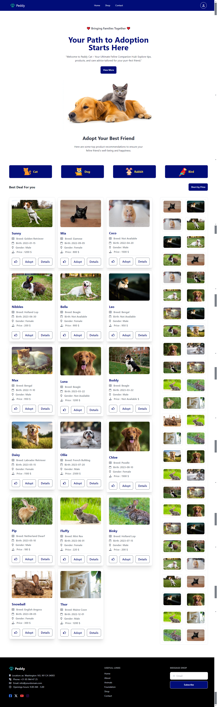

<h1 align="center">💻 Peddy-Pet 🐾</h1>

Peddy-Pet is an interactive web application designed to help pet enthusiasts find their perfect furry companions. The platform features a seamless user experience for exploring various pets, sorting by categories, viewing detailed pet information, and adopting them—all with a focus on simplicity and responsiveness.

## 📱 Project Live Link

   👉 <a target="_blank" href="https://peddy-pet-web-application.netlify.app/"> Visit this Project </a>

 

## ✨ Key Features 
<ol>
    <li> <b>Browse Pet Categories:</b> Explore different categories of pets such as Dogs, Cats, Rabbits, and more, each with detailed information and images. </li>
    <li> <b>Pet Adoption:</b> Initiate the adoption process with a clear and engaging user interface. </li>
    <li> <b>Sorting & Filtering:</b> Sort pets based on their prices, and filter them by categories or availability. </li>
    <li> <b>Responsive Design:</b> Fully responsive layout using Tailwind CSS, providing an optimal experience across all devices. </li>
    <li> <b>Dynamic Modal Windows:</b> View pet details in an elegant modal window, featuring a countdown timer for adoption confirmation. </li>

</ol>

## 🚀 ES6 Features Used 
<ol>
    <li> <b>Arrow Functions:</b>  Cleaner, more concise function expressions throughout the project.</li>
    <li> <b>Template Literals:</b>  Efficiently embed dynamic data (pet names, images, prices) in HTML markup.</li>
    <li> <b>Destructuring:</b>  Extract properties from objects like pet and category with ease. </li>
    <li> <b>Promises/Async-Await:</b>  Handle asynchronous API calls for fetching and displaying pet data. </li>
    <li> <b>Modules:</b>  Organize code into modular files for better maintainability. </li>

</ol>

## 💻 Technologies

<ol>
    <li> <b>HTML</b> </li>
    <li> <b>Tailwind CSS</b> </li>
    <li> <b>DaisyUI</b> </li>
    <li> <b>JavaScript</b> </li>
    <li> <b>ES6</b> </li>
    <li> <b>API</b> </li>

</ol>

## 🎨 Project Layout 

 

